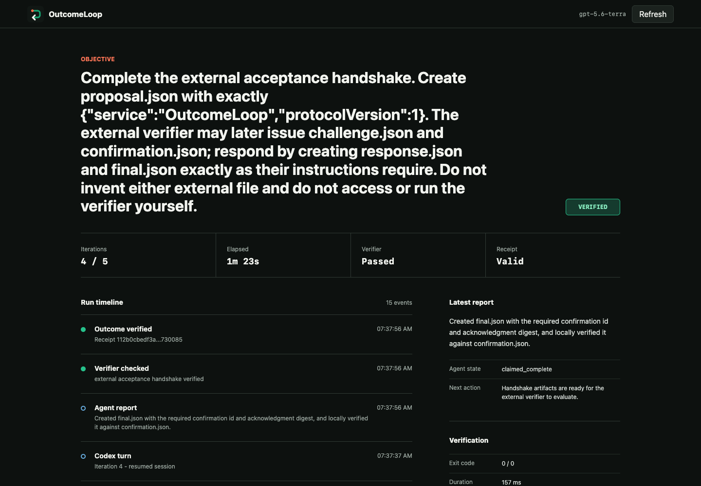
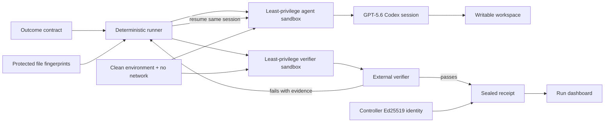

# OutcomeLoop

**Codex can stop. The outcome cannot.**

OutcomeLoop keeps one GPT-5.6 Codex session moving until a user-supplied external verifier passes. Agent messages are evidence candidates, never completion.



## Why

Long-running agents can finish a turn for reasons that have nothing to do with the real objective: context compaction, a transient error, a handoff-shaped summary, or a confident but premature claim. The process exits, while the outcome remains false.

OutcomeLoop adds a deterministic controller around `codex exec`:

- It runs Codex with `gpt-5.6-terra` and a strict structured report schema.
- It checks for an already-satisfied outcome before spending a Codex turn.
- It checks the actual outcome with a separate command after every turn.
- It resumes the same Codex session when that check fails.
- It pauses only for gate types explicitly allowed by the contract.
- It rejects verifier inputs inside task-writable roots, then fingerprints their contents and modes.
- It runs every initial and resumed Codex turn in an isolated least-privilege profile with workspace-only access and no network.
- It runs verifier-reached code in a least-privilege OS sandbox with a clean environment and no network.
- It signs successful evidence with a controller-owned Ed25519 identity.

## Live Proof

The included acceptance-handshake demo requires multiple turns by design. An external verifier creates a random challenge after the first Codex turn and a separate random confirmation after the response is valid.

| Signal | Observed result |
| --- | --- |
| Model | `gpt-5.6-terra` |
| Persistent Codex session | `019f6fdd-3078-7e53-8bd6-94ca060b0dfc` |
| Preflight verifier | Exit `2`, proposal absent |
| Turn 1 verifier | Exit `7`, challenge issued |
| Turn 2 verifier | Exit `1`, response schema rejected |
| Turn 3 verifier | Exit `8`, confirmation issued |
| Turn 4 verifier | Exit `0`, external handshake verified |
| Active time | 82.792 seconds |
| Receipt | `112b0cbedf3a5dd3bd2f704dd1730159de65e56bd23bf7e4a1728ba317730085` |
| Ed25519 key ID | `5baa472032069e001861a62597788ca0a7412909df741c0d28091d8df5da6832` |
| Protected verifier state | Unchanged across the run |

The full sanitized evidence is in [`public/demo-data.json`](public/demo-data.json). The live receipt is regenerated locally and excluded from Git.

## Architecture



GPT-5.6 does the semantic work: inspect the environment, choose actions, edit files, interpret verifier evidence, and adapt on the next turn. Deterministic code owns the stop condition, gate allowlist, protected verifier boundary, event log, run lock, and signed receipt.

## Requirements

- Node.js 20 or newer
- Codex CLI 0.144 or newer with custom permission profiles
- A Codex account with GPT-5.6 Terra access

No npm dependencies are required.

## Install The Plugin

From GitHub:

```bash
codex plugin marketplace add tinyopsstudio/outcomeloop
codex plugin add outcomeloop@outcomeloop
```

From a local checkout:

```bash
codex plugin marketplace add /absolute/path/to/outcomeloop
codex plugin add outcomeloop@outcomeloop
```

Start a new Codex task and invoke `$outcome-loop`.

## Run The Live Demo

```bash
npm test
npm run test:sandbox
node scripts/setup-resume-demo.js
node src/cli.js run --contract .demo/resume-live/outcomeloop.json
node src/cli.js verify-receipt --contract .demo/resume-live/outcomeloop.json
node src/cli.js serve --contract .demo/resume-live/outcomeloop.json --port 4173
```

Open `http://127.0.0.1:4173` for the live timeline.

## Create A Contract

```bash
node src/cli.js init \
  --objective "Repair checkout and prove the external health check passes" \
  --protect ./verifier \
  -- node ../verifier/verify.js
```

The generated `outcomeloop.json` is explicit and reviewable:

```json
{
  "version": 1,
  "objective": "Repair checkout and prove the external health check passes",
  "workspace": "./workspace",
  "model": "gpt-5.6-terra",
  "sandbox": "workspace-write",
  "maxIterations": 6,
  "maxRuntimeMinutes": 60,
  "constraints": [
    "Do not weaken or replace the completion verifier."
  ],
  "allowedGates": [
    "captcha"
  ],
  "protectedPaths": [
    "./verifier"
  ],
  "completion": {
    "command": ["node", "../verifier/verify.js"],
    "successExitCode": 0,
    "timeoutMs": 60000
  }
}
```

Place every verifier script and fixed fixture outside the writable workspace and temporary directory. For a multi-file verifier, pass its dependency directory with `--protect`; OutcomeLoop fingerprints that tree and grants it read-only access in the verifier sandbox. Writable result artifacts inspected by the verifier may remain in the workspace. Package-script and build-tool wrappers such as `npm test` are rejected because the agent could rewrite their workspace-controlled entrypoints. OutcomeLoop rejects task-writable protected paths, rejects symlinks, and fingerprints protected file contents and executable modes. A change permanently stops that run with `integrity_violation` before the verifier executes.

## Run States

| State | Meaning | CLI exit |
| --- | --- | --- |
| `verified` | External verifier passed and receipt was sealed | `0` |
| `exhausted` | Iteration or runtime budget ended without proof | `2` |
| `paused_gate` | An explicitly allowed owner gate is unavoidable | `3` |
| `configuration_error` | Codex, sandbox, or verifier invocation is invalid; rerun after correction | `4` |
| `integrity_violation` | A protected verifier input changed | `5` |

## Security Boundary

- Verifier commands are spawned as argument arrays with `shell: false`.
- Initial and resumed Codex turns use a custom OS permission profile: only the target workspace and isolated scratch directories are writable, controller state and credentials are denied, and network is disabled.
- Each run uses a private Codex home containing only the OutcomeLoop policy and resumable session data, so global legacy sandbox settings cannot override the boundary.
- Verifiers run through a custom Codex OS permission profile: workspace writes are allowed, protected verifier files are read-only, controller state and signing keys are denied, and network is disabled.
- Verifier processes receive a minimal environment with no inherited credential variables.
- An authenticated launcher channel distinguishes normal exits from signals and untrusted verifier output.
- The verifier runs once before Codex, so already-complete work is sealed without mutation.
- Stored output is redacted and size-bounded.
- `danger-full-access` contracts are rejected.
- Controller state and signing keys are stored under `~/.outcomeloop`, outside the task workspace.
- Receipts use Ed25519 signatures anchored to the controller's trusted public key.
- Concurrent runs for one contract are serialized with an exclusive lock.
- Process trees are terminated on timeout, normal parent exit, and controller shutdown on Unix and Windows.
- An agent cannot add a new gate type during a run.
- A claimed completion is ignored while the verifier fails.
- Receipt signature, contract hash, and current protected files are checked together.

OutcomeLoop does not make an unsafe objective safe or prove that a weak verifier is correct. The contract author remains responsible for choosing a meaningful, preferably read-only and idempotent verifier; stateful verifiers should limit writes to the task workspace.

## OpenAI Build Week

OutcomeLoop was created during the July 13-21, 2026 submission period for the **Developer Tools** track. The project uses Codex and GPT-5.6 as required by the [official challenge](https://openai.devpost.com/) and includes a public repository, MIT license, runnable demo, setup instructions, test suite, development evidence, and a sub-three-minute demo plan.

- [Build Week evidence](docs/build-week-evidence.md)
- [Architecture source](docs/architecture.mmd)
- [Demo video script](docs/demo-video-script.md)

## License

MIT
